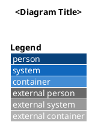
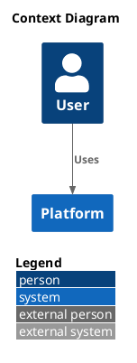
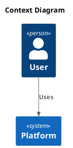
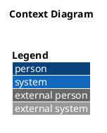

# Plantuml Diagram Generator

## Overview

This skill provides automated assistance for PlantUML diagram generation in the Visual Content domain, with strict quality gates for C4 diagrams.

## CRITICAL

These rules apply to all generated C4-PlantUML outputs unless explicitly marked as non-C4 by the requester.

- `LAYOUT_WITH_LEGEND()` is mandatory for all C4 diagrams.
- A valid C4 include directive is mandatory (`!include`, `!includeurl`, or `!include_once`).
- `LAYOUT_WITH_LEGEND()` must appear exactly once and must be placed after include directives.
- If a rule is violated, auto-fix and re-validate before returning output.

## When to Use

Activate this skill when requests involve:

- PlantUML diagram generation or refinement
- C4 model diagrams (context, container, component, deployment)
- Diagram best practices, formatting, and validation

## Scope and Non-Scope

| Diagram Type                                    | `LAYOUT_WITH_LEGEND()` Required | Handling                                 |
| ----------------------------------------------- | ------------------------------- | ---------------------------------------- |
| C4 diagrams                                     | Yes                             | Enforce strictly and auto-fix on failure |
| Non-C4 PlantUML (sequence/class/activity/state) | No                              | Explicitly state rule is not applicable  |

## Mandatory Rules

1. Always return complete PlantUML blocks with `@startuml` and `@enduml`.
2. For C4 diagrams, include C4 library directives before `LAYOUT_WITH_LEGEND()`.
3. Never emit duplicated `LAYOUT_WITH_LEGEND()` calls.
4. Preserve deterministic structure: include -> layout -> title -> elements -> relations.
5. When user input conflicts with mandatory C4 rules, prioritize safety and explain the correction.

## Validation Checklist

Validate all generated diagrams before final output:

1. `@startuml` and `@enduml` exist.
2. C4 include is present when diagram is C4.
3. `LAYOUT_WITH_LEGEND()` exists exactly once when diagram is C4.
4. Include directives appear above `LAYOUT_WITH_LEGEND()`.
5. Diagram parses with no PlantUML syntax errors.
6. Legend is visible or renderer limitation is stated.

## Auto-Fix Workflow

If validation fails, apply this order:

1. Insert missing include directive.
2. Insert missing `LAYOUT_WITH_LEGEND()` below include directives.
3. Remove duplicate `LAYOUT_WITH_LEGEND()` calls.
4. Reorder lines to match include -> layout -> body sequence.
5. Re-validate and return only compliant output.

## Standard Template

Use this baseline for all C4 outputs:

Template rules:

- Do not remove `LAYOUT_WITH_LEGEND()` for C4 diagrams.
- Keep includes above `LAYOUT_WITH_LEGEND()`.
- Modify only title, elements, and relations unless deeper customization is requested.

## Do and Don't

### Do

### Don't (missing layout)

### Don't (duplicated layout)

## Output Contract

Final responses should contain:

1. Generated PlantUML code block.
2. Validation result summary (pass/fail per checklist item).
3. Any auto-fixes that were applied.

## Error Handling Matrix

| Error                            | Cause                               | Resolution                                |
| -------------------------------- | ----------------------------------- | ----------------------------------------- |
| Missing `LAYOUT_WITH_LEGEND()`   | Rule omitted during generation      | Insert below include and re-validate      |
| Duplicate `LAYOUT_WITH_LEGEND()` | Merge/refactor introduced duplicate | Keep one, remove extras, re-validate      |
| Missing C4 include               | Incomplete template or manual edit  | Add valid C4 include and re-validate      |
| Include resolution failure       | Invalid path or network restriction | Switch include method and report fallback |
| PlantUML parse error             | Syntax issue in elements/relations  | Correct syntax and rerun validation       |

## Prerequisites

- PlantUML rendering environment
- Access to C4-PlantUML includes (local or URL)
- Basic understanding of C4 modeling concepts

## Resources

- Official PlantUML docs
- C4-PlantUML references
- Community examples for context/container/component diagrams

## Related Skills

Part of the **Visual Content** skill category.
Tags: diagrams, plantuml, c4, charts, visualization, presentations
